# **Patrick Apilukpuvadol and Francis Lam T3A1**
********************************
## **Travelling Diary: MERN full-stack app assignment**
*****************************************

****************

### Purpose

Our Client wanted to establish a full stack web application, the web app will serve 2 main purposes. First purpose is to allow users to log and share their experiences from their travels. Second purpose is allow client to login and manage the content of the posts. 

The client wanted to establish this platform to create a niche and target a consumer base that has a strong focus on travel experiences and tips. The client realised that although there is social media applications and booking web applications that allow users to post content about where they have travelled, there was no application available that essentially combined the features of both with a focus on experiences and tips for other users. The client wanted to establish this app to allow users to be able to effectively search for unique experiences posted by others with a sole focus on travel instead of either just scrolling through all the other content of social media apps or search for destinations with no prior knowledge provided that allows them to make the most of their trip. 

*********

#### Target Audience

This application is targeting Young adults up to Parents with different reasons and budgets for travel. 

#### User Stories

##### Market Research

1. As a user, I want to be able to view detailed information about each travel destination, including photos, descriptions, and comments, so that I can make informed decisions about where to go.

2‌. As a user, I want to be able to search for specific travel destinations or blog posts so that I can quickly find the information I need.

‌3. As a user, I want to be able to create an account and log in so that I can access personalized features and save my preferences.

4‌. As a user, I want to be able to create and edit my own blog posts to share my travel experiences and tips with others.

‌5. As an administrator, I want to be able to manage user accounts, including approving new registrations and enforcing security measures.

6‌. As a developer, I want to ensure that the website is responsive and mobile-friendly, so that users can access it from any device.

7‌. As a developer, I want to implement a secure authentication system to protect user accounts and sensitive data.

#### Iterated Personas of Target Users

**Persona 1: Adventurous Alan**

Age: 33

Occupation: Software Engineer

Interests: Traveling, outdoor activities, photography

Background: Alan is a passionate traveler who loves exploring new places and documenting his experiences through photos. He enjoys trying out adventurous activities like hiking, scuba diving, and skydiving. As a software engineer, he appreciates well-designed and user-friendly websites and apps. Alan is always on the lookout for travel blogs that provide detailed itineraries, tips, and stunning visuals to inspire his next adventure.

**Persona 2: Wanderlust Wendy**

Age: 25

Occupation: Digital Nomad

Interests: Traveling, blogging, remote work

Background: Wendy is a digital nomad who works remotely while traveling the world. She enjoys immersing herself in different cultures, trying local cuisines, and meeting new people. Wendy is passionate about sharing her experiences through her travel blog, and she is always in search of new destinations and hidden gems to write about. She values web applications that offer a seamless user experience and provide valuable information about travel destinations, accommodations, and transportation.

**Persona 3: Budget Traveler Ben**

Age: 18

Occupation: Student

Interests: Traveling on a budget, backpacking, local experiences

Background: Ben is a student who loves traveling during his breaks. He often travels on a tight budget and looks for affordable accommodations, transportation options, and local experiences. He enjoys exploring off-the-beaten-path destinations and interacting with locals to get a true taste of the culture. Ben relies on travel blogs to find tips and tricks for budget travel, including suggestions for cheap eats, free attractions, and affordable accommodations.

**Persona 4: Family-oriented Fiona**

Age: 45

Occupation: Stay-at-home mom

Interests: Family-friendly travel, kid-friendly activities, family accommodations
Background: Fiona is a mom of two young children who loves traveling with her family. She looks for destinations that offer a range of family-friendly activities and accommodations. Fiona values travel blogs that provide recommendations for attractions suitable for kids, tips for traveling with children, and advice on finding family-friendly accommodations. She wants to ensure her family has a memorable and enjoyable travel experience while keeping everyone's needs in mind.

*********

#### Functionality/ Features

The Full stack application will be have a variety of features specifically for two groups. The User and the admin staff managing the application. Features will be as follow:

**All Users:**
The application will be protected and will require all users to login via authentication which will assign them the appropiate permissions such as user and admin. Users will be prompted to create an acount through the web application while admin users will need their accounts established by the assign data manager. 
- Login
- Logout

**Users**
When authenticated, users are allowed to access their personalised Dashboard that will feautrem recommended blogs and experiences based on their preferences and interests. 
- Create an Account 
- Display their content
- Edit their content
- Delete their content
- View other users' content
- Like/Unlike users' content
- Comment on users' content
- Follow/Unfollow users

**Admin** 
Once the Admin has been provided with credentials that grant them permissions and access to manage content as required for their role 
- Create/Delete/Edit/View Users
- Create/Delete/Edit/View Users' Content
- Manage User permissions
- Moderate content

****************
#### Planning (Sprints)

At the beginning of the project we had a briefing to delegate tasks and design a rough idea of how the app works. We then used Trello as a workload planner to organise and prioritise taks. We were responsible for ensuring that we completed appointed tasks in a timely manner and ensured we added notes to encourage communication during our regular meetings. We will hold regular status meetings through discord to communicate any issues and challenges we encounter during this project. 

With planning initially we plan to have the sprint organised in weekly sprints 

**Week 1**
- Implementation and establishment of Front-end and Back-end
- Establish login functionality for Users and Admin
- Integrate Amazon S3 functionality

**Week 2**
- Program CRUD functionality for both Users and Admin
- Integrate Google API functionality
- Integrate Personalised Dashboard for users 

**Week 3**
- Testing of code
- Front end cleaning up and testing for responsiveness
- Final touches before launch

Currently we have the Trello Screenshots for plannaing stage of MERN stack web application (see below)

***************

#### Workflow

We decided to work as a team within a Github Organisation and utlise forking to maintain integrity of version control. This will allow us to monitor changes made by team members effectively. We will be checking each of the pull requests to the main branch. We believe this will be the best approach to working in an agile project environment with team members working across on different aspects of the web application. Most tasks will be completed alone by each team member so this branching and pull requests will allow other team member to keep track of other's work. 

#### Dataflow Diagram

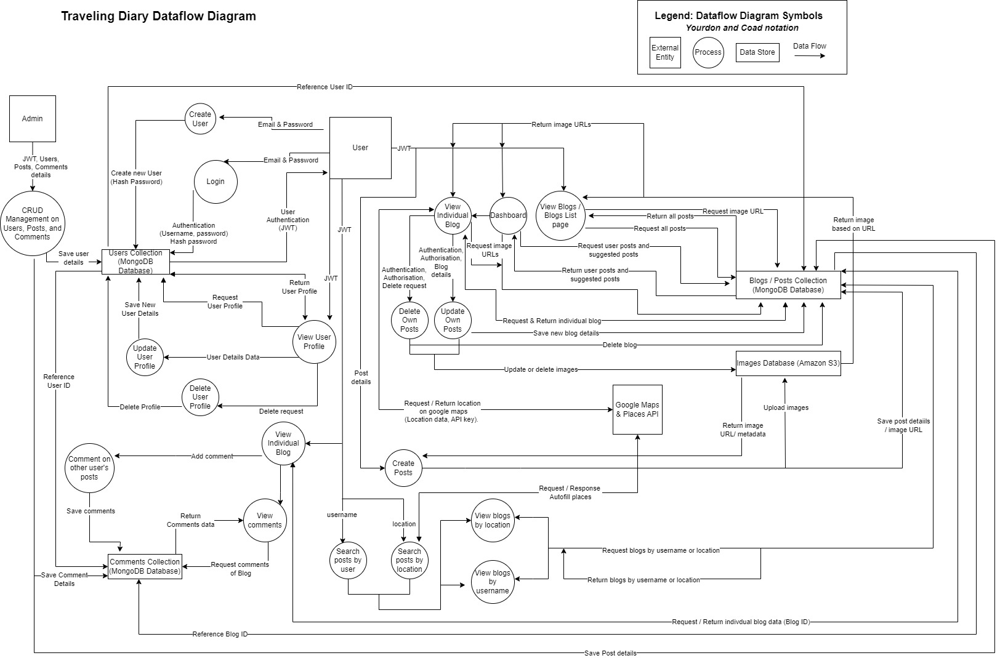

****************

#### Application Architecture Diagram

****************

### Wireframes  

* Link to Travelling Diary wireframe in Figma: [Travelling Diary wireframe](https://www.figma.com/file/2SzEZyh3gIW4xpwTy1KAYM/Traveling-Diary?type=design&node-id=0-1&mode=design&t=jx4ebmZ2z4hPXJbJ-0).  

In the link above it clearly illustrates the relationships between each page of the application. Also, the functionality of each page and it's features are explained in detail.  

A mobile first approach was implemented when designing the wireframes for this application. We wanted a light-coloured themed interface for the application that was easy to use. Based on this criteria, we chose to use the colours white, black and two different shades of orange. 

#### Mobile Login Page 

* It can be seen in the image below that the login page and create account page are essentially the same except for some of the wording. Initially, these two pages did not look like this, as we didn't have a logo designed and there was an image in the background. Upon further development, the background image was removed and a logo was created. The logo was placed near the top of the page as this introduces our brand to the user. This is then followed by the login heading and the login details, which are position in the center of the page. Two orange bars were added to the top and bottom of the page to give it the light orange coloured theme design.  

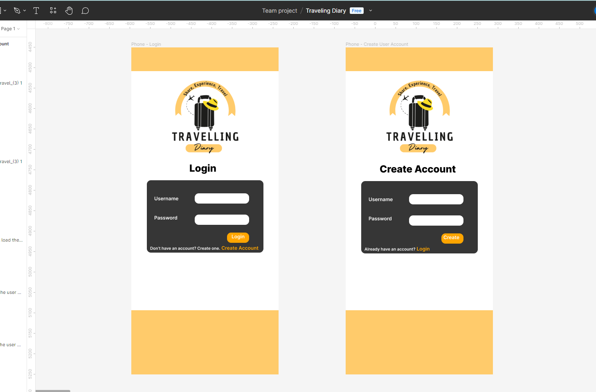  

#### Mobile Blogs List Page  

* With the blogs list page I positioned the search bar at the top of the page, this lets the user search for more specific blogs based on a location or username. The searchbar will always be visible when scrolling up or down. The blogs list page just displays a list of random blogs (most recent posts). After the search bar a heading of "Blogs List" is displayed to indicate the list of blogs below. The blogs are displayed as cards with an image as well as minimal information like username, title of blog, location / country. The information is overlapping with the image as I wanted to save some space on the page. A gray background is overlayed on top of the image for better visiblity of the text. Based on the layout of the cards, we can use the React-Bootstrap library to create the layout (cards component and grid system). A navigation bar is displayed at the bottom of the page and will always be visible so users can easily navigate to other pages. 

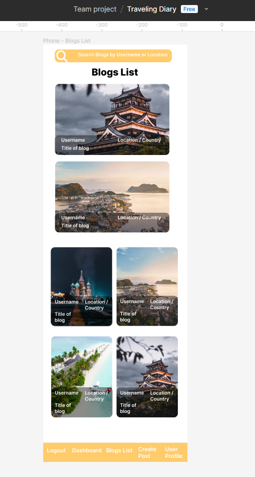  

#### Mobile Blog Page and (Edit view)  

* The layout of the blog page is similar to the blog list page in that the search bar is at the top and the heading is below that, and the navigation bar is at the bottom of the page. Details of the blog like username, title of blog, description, etc. are displayed near the top of the page to show the user more detailed information about the blog. As this is a travel blogging application, we wanted to make sure that the pictures took up a large portion of the screen, this improves the aesthetics of the application and user experience. Below the pictures are a couple of buttons and icons that allow the user edit the blog if the user created the blog. These functions include editing the pictures, liking the blog (any user can like a blog), edit post button (allows the user to edit details of the blog), and delete post button. Next is a comments section, where the user can view comments and add comments to the blog. The last section displays the location of the blog on google maps (using google maps API).  
* The edit view of the blog page was initially created with all input boxes for all the data fields like title of post, location, and description. However, this was changed to have a edit post button to edit the details of the post, as there were multiple data points for location details (i.e. city, country, name of location, etc.) to edit. Once, the user clicks on the edit post button the user is redirected to an update post page to edit the details. 

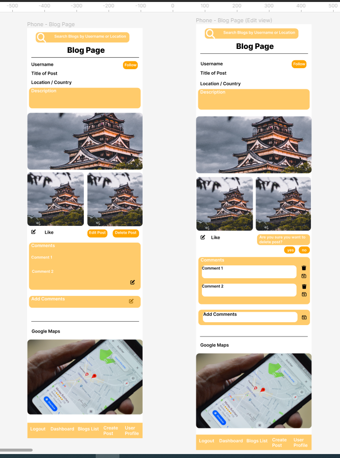  

#### Mobile Location and Username Blog Pages  

* These two pages have the same layout as the blog list page. They are the pages that will be rendered when a user searches for blogs in a specific location or username.

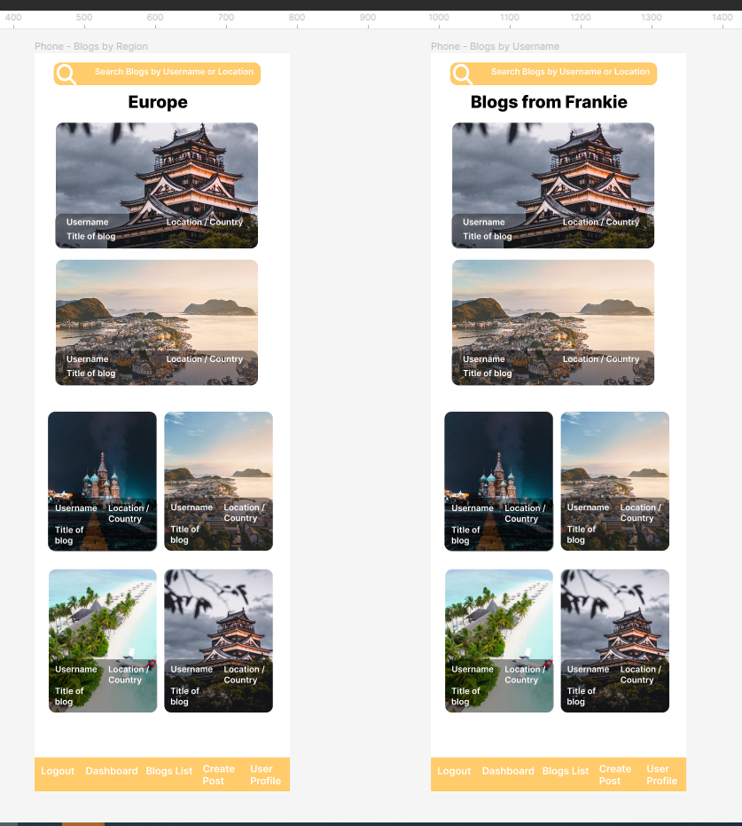  

#### Mobile User Profile and Edit view Pages  

* This is the user profile page, I placed the profile image at the top of the page followed by username as a heading to indicate to the user that they are in their profile page. Below that will be a section containing all the information stored for the user. In the edit view mode a form will appear to allow changes to be made to the profile. All elements in the form will be evenly spaced.

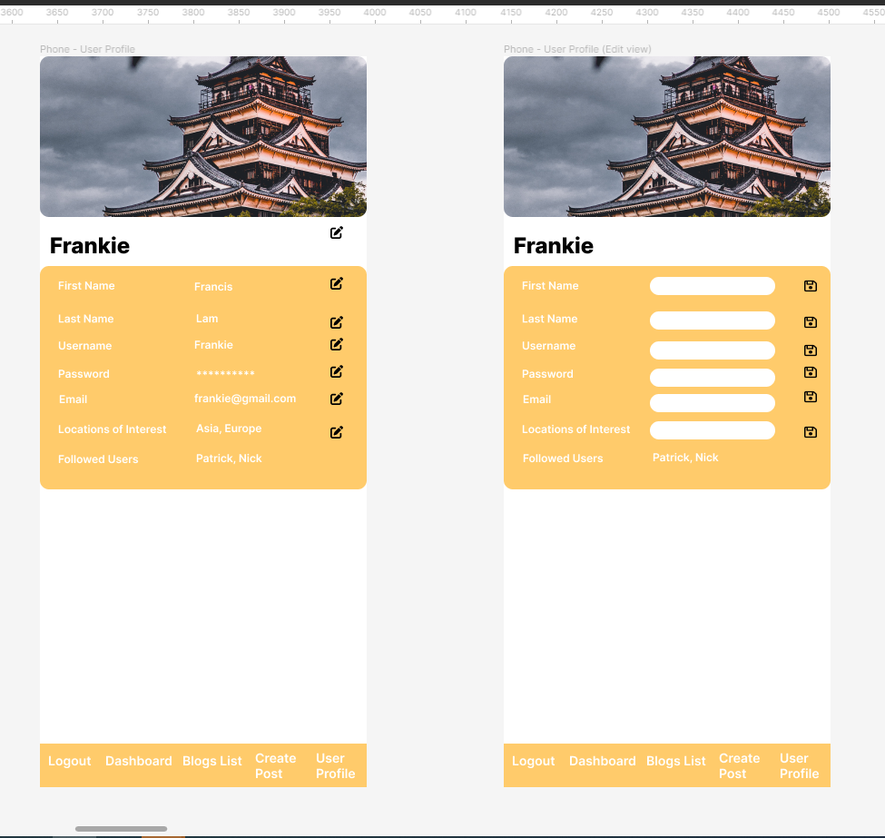  

#### Mobile User Dashboard Page  

* The layout of the dashboard in similar to the blog list page, but there are different sections on the dashboard. Depending on the user's preferences in their profile (i.e. locaitons of interest, followed users), blogs will be listed in each section respectively. I placed arrow buttons on the side of the blog cards so that users can load the next set of blogs related to that section.

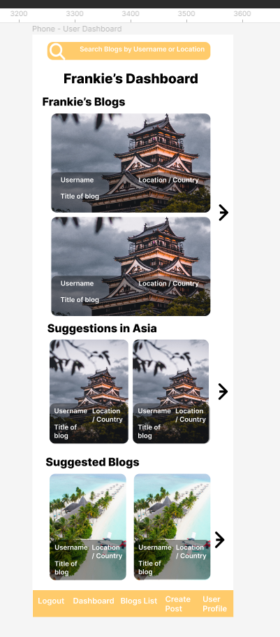  

#### Mobile Create and Edit Post Pages

* The create and edit post pages are essentially the same. They both have simple form layout.

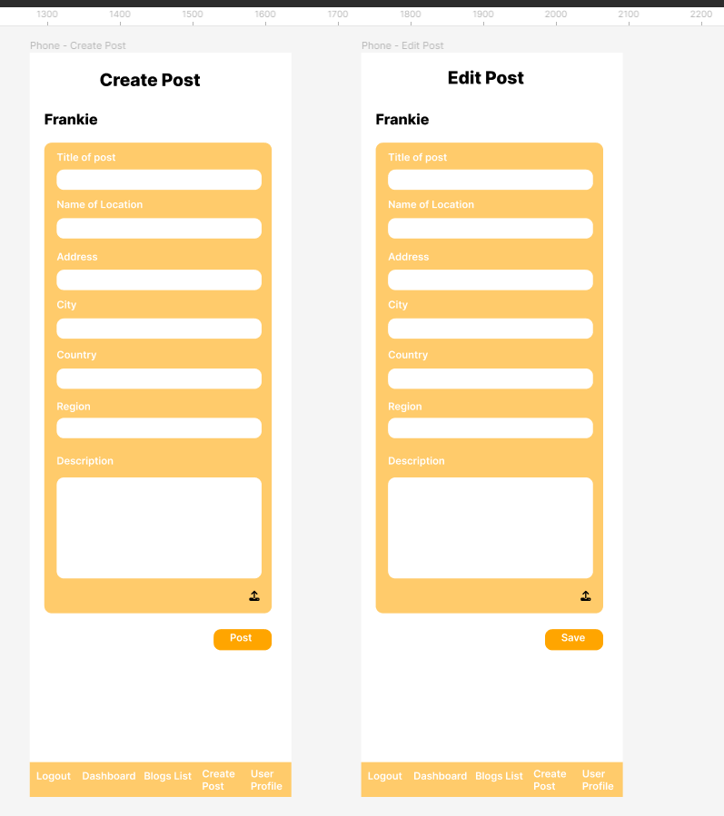  

#### Tablet Application Pages  

Link to Travelling Diary wireframe in Figma: [Travelling Diary wireframe](https://www.figma.com/file/2SzEZyh3gIW4xpwTy1KAYM/Traveling-Diary?type=design&node-id=0-1&mode=design&t=jx4ebmZ2z4hPXJbJ-0).  

* All of the tablet pages are essentially the same as the mobile view pages, except the top of the pages are slightly different in that there is the name of the applcation at the top of the pages as well as the navigation bar. Also, the blogs list and dashboard pages contain an extra set of blogs to fill up the space of the wider screen size. We tried to keep the layout similar to the mobile view as this would make it easier to create a responsive website with the use of certain components in React-Bootstrap library, like cards and grid system.  

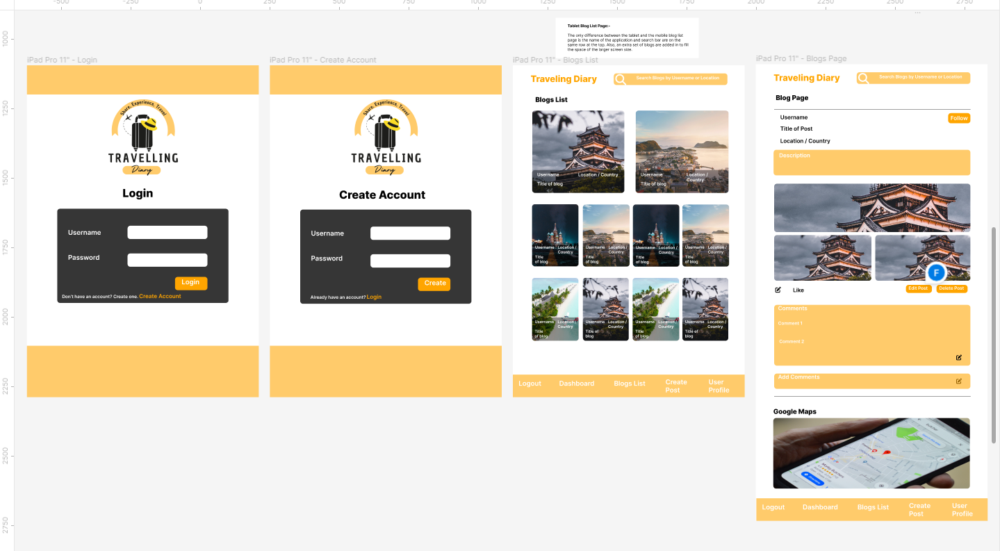  

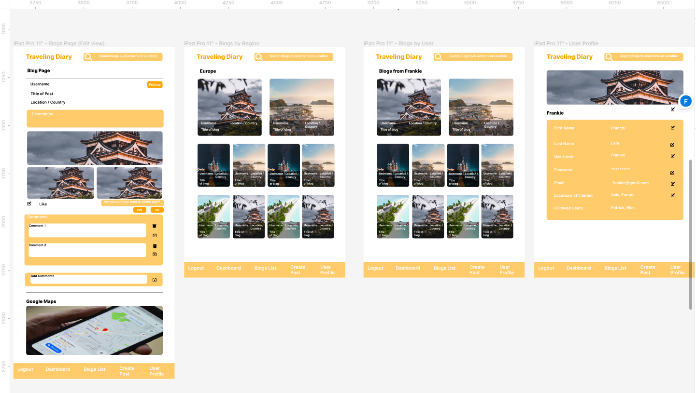  

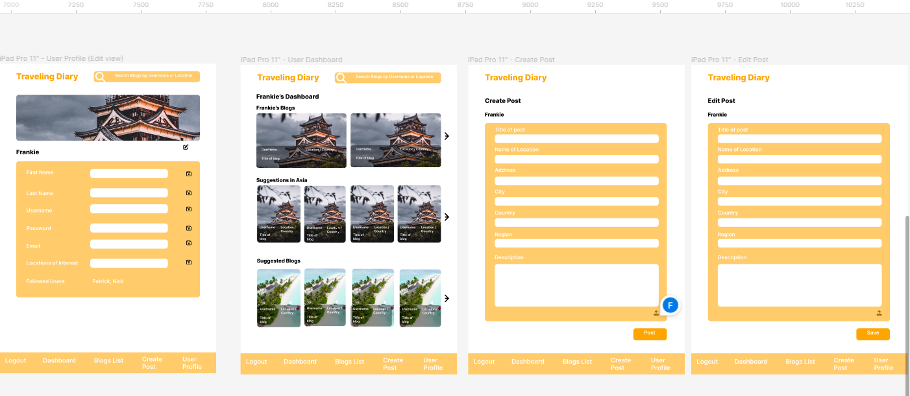  

#### Desktop Application Pages  

Link to Travelling Diary wireframe in Figma: [Travelling Diary wireframe](https://www.figma.com/file/2SzEZyh3gIW4xpwTy1KAYM/Traveling-Diary?type=design&node-id=0-1&mode=design&t=jx4ebmZ2z4hPXJbJ-0).  

* The destop pages are very similar to the tablet pages, except the navigation bar is set at the top of the page, along with the name of the application and search bar. The nav bar and search bar will always be visible when scrolling down the page to allow the user to easily access other features of the application. The blog page layout is slightly different to the tablet and mobile views, in that the details of the blog and pictures are placed beside one another due to the wider screen size. Reponsiveness was taken into account when designing the layout of the application to allow ease of coding

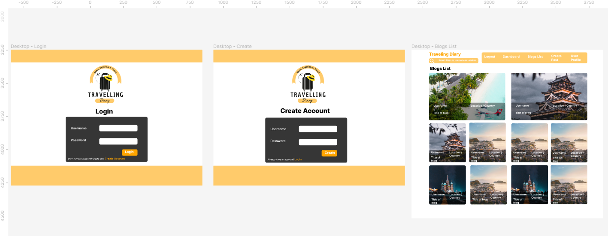  

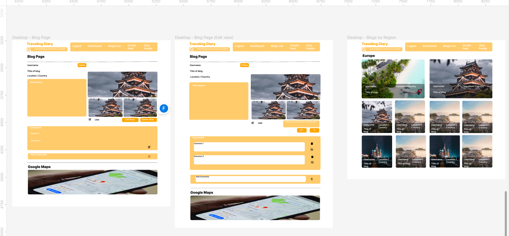  

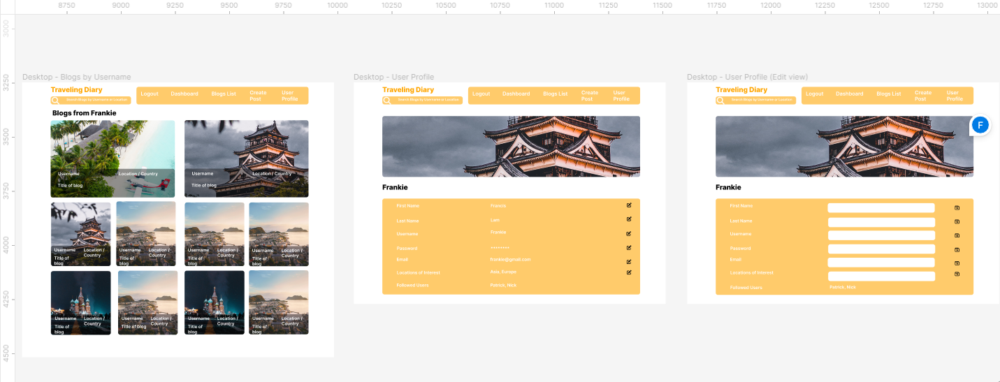  

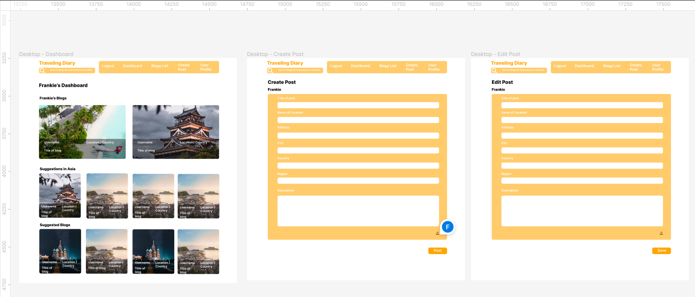

*************

## Technologies Used

- MongoDB: NoSQL database for storing user and travel log data.
- Express: Node.js framework for building the server-side API.
- React: Frontend library for building the user interface.
- Node.js: JavaScript runtime environment for server-side development.
- Redux: State management library for managing application state.
- Axios: HTTP client for making API requests.
